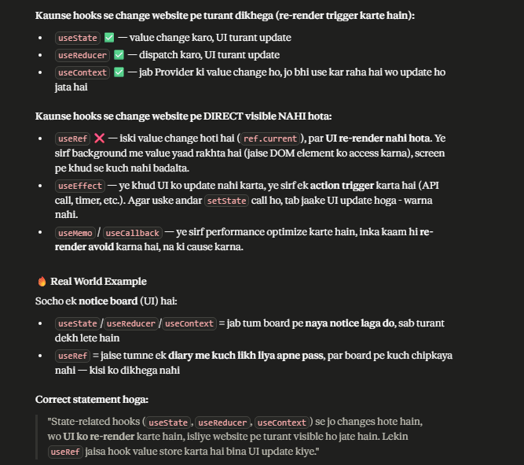

#Hooks -- "State-related hooks (useState, useReducer, useContext) se jo changes hote hain, wo UI ko re-render karte hain, isliye website pe turant visible ho jate hain. Lekin useRef jaisa hook value store karta hai bina UI update kiye."

 -- Hooks aise functions hain jo use se start hote hain (useState, useEffect, useRef, etc.) aur inhe hum apne function component ke andar call karte hain.

useState - state ko manage krne ke liye

useEffect - side effects handle krne ke liye (jaise API call,DOM Manipulation , event listener)

useContext - global state ko consume krne ke liye without prop drilling

useReducer - complex state management ke liye (Redux jaise chota version)

useRef - mutable values hold krne ke liye jo re-render trigger na kre , ya DOM access krne ke liye

useMemo & useCallBack - optimization ke liye , unnecessary re-renders avoid krne ke liye